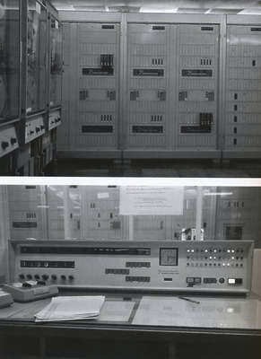
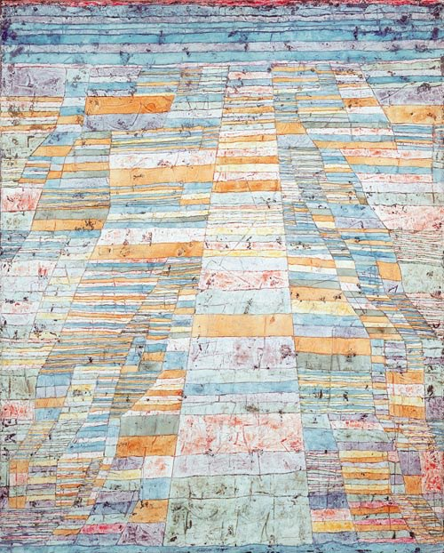
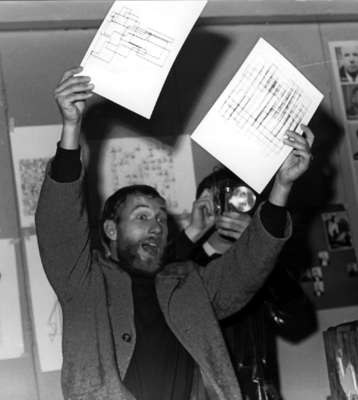
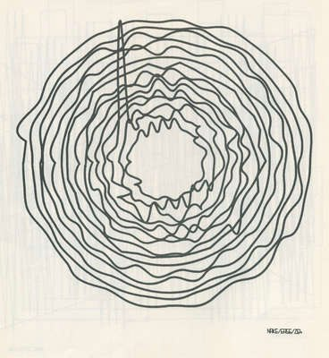

# Один из иконических примеров раннего...

Один из иконических примеров раннего генеративного искусства, “Оммаж Паулю Клее” (1965) Фридера Наке (Frieder Nake), был запрограммирован в Штутгарте на первом европейском транзисторном компьютере, ER 56, вдохновленный картиной Клее "Hauptweg und Neberwege" ("Главная дорога и окольные дороги"). Монитора у компьютера не было, экземпляры (40 штук, все разные) печатались на графопостроителе ZUSE Graphomat Z64. Графопостроитель соединялся с компьютером перфолентой: компьютер пробивал дырочки, графопостроитель их распознавал как команды. На работах видна подпись всех трех артистов: NAKE/ER56/Z64 (тоже запрограммированная).

“Рисунки были не очень захватывающими, но то ли дело сам «принцип»!” – не очень, на мой взгляд, справедливо вспоминает Наке свои ранние работы. Работа с волнистыми кругами (Kreis-Variation Nr. 3, 1965) написана при помощи интерполяции, т.е., генерации непрерывной кривой по набору точек, в данном случае, псевдослучайно сгенерированных. Использованный метод интерполяции не гарантирует, что кривая будет, скажем так, аккуратной – резкий пик на рисунке это его незапланированный эффект: “Если хотите, можете объявить это творческим решением алгоритма. Но это было бы глупее всего. Алгоритмы не творят, но они и не не-творят. Они суть то, что они есть: формальные описания вычислимых функций”, объясняет Наке в описании для своего сайта-галереи compArt database Digital Art (daDA)[1].

Но не совсем так он думал в 1960-х. Его работы основывались тогда на эстетической теории Макса Бенсе, уверенного, что эстетическое значение объекта можно объективно измерить. Понятие интуиции вводилось Бенсе для объяснения влияния шанса, удачи. Из всей теории, Наке в первую очередь использует именно его: “Программа должна быть способной выполнять заданную схему эстетического объекта во всех его вариантах. Это нужно рассматривать по аналогии с подходом художников, которые преследуют тему с помощью своей интуиции во всех направлениях. Под интуицией нужно понимать выбор возможностей из заданного репертуара. Эта интуиция симулируется вычислительной машиной через автоматический выбор псевдослучайных чисел”[2]. Эти числа будут использоваться программой для выбора количества и расположения элементов, направления штриховки и т.п. Это понимание интуиции полностью противоположно ее философскому пониманию, у многих философов имеющему отношение к познанию. То неопределенное чутье, позволяющее художнику остановиться на конкретном способе реализации идеи, заменяется тут на пустоту безпредпосылочного произвола.

В 1966 прогнозы Наке о будущем искусства явно близки к кибернетике: он пишет о программах будущего, которые бы в ходе вычисления рисунка "эстетически" бы оценивали уже нарисованное и в соответствии с этим меняли ход дальнейшего вычисления. К 1971 году он, однако, приходит к выводу, что такого рода творчество несовместимо с его радикально левыми убеждениями, объявляет, что “Компьютерное искусство не должно существовать” и переезжает из буржуазного Штутгарта работать в пролетарский университет Бремена. Его соавтор, компьютер ER 56, попал, разобранный, в руки Эрнста Кнеппера, штутгартского enfant terrible, который нанял грузчиков, чтобы ночью, тайком пронести 25-тонную махину в Штутгартскую академию искусств, надеясь навязать академии новые технологии. Ректор не оценил жест и подал на Кнеппера в суд, пытаясь избавиться от ненужного подарка.

“Оммаж Паулю Клее”, реализованный заново в 2012 г. в среде Processing: https://www.youtube.com/watch?v=HwyMVZybG8g .

На картинках: один из вариантов “Оммажа Паулю Клее”; компьютер ER 56; графопостроитель ZUSE Graphomat Z64; “Hauptweg und Neberwege” Пауля Клее; Фридер Наке с авторскими экземплярами (1966); Kreis-Variation Nr. 3.
В pdf-ке: все картинки из отчета Наке 1966 г.

[1] http://dada.compart-bremen.de/item/artwork/1304
[2] http://dada.compart-bremen.de/docUploads/ProgrammInformation21_PI21.pdf











```
{"type": "video", "video": {"access_key": "cd53f825694c1b033b", "can_comment": 0, "can_like": 1, "can_repost": 1, "can_subscribe": 1, "can_add_to_faves": 1, "can_add": 1, "comments": 0, "date": 1491744053, "description": "For Golan Levin's Interactive Art Class, I recreated Frieder Nake's 1965 computational art piece 13/9/65 in Processing. Each time random decisions are made to draw the horizontal lines, vertical lines and circles, making it impossible to know what the piece will look like before it has finished being drawn.", "duration": 59, "photo_130": "https://sun9-24.userapi.com/c639519/u1042307/video/s_7f507423.jpg", "photo_320": "https://sun9-69.userapi.com/c639519/u1042307/video/l_40fa56ac.jpg", "photo_640": "https://sun9-11.userapi.com/c639519/u1042307/video/y_54e9305b.jpg", "id": 456239018, "owner_id": -140963346, "title": "Processing Version of 13/9/65 Nr. 2 by Frieder Nake", "track_code": "video_4d258836jJphlIcAX7IG7zBGev7eV4NehVQ_L5Q3XP--22Dq1dC-t3qWgARQ2wTkBHAlyuthsW28ZA4XkA", "views": 16, "local_views": 16, "platform": "YouTube"}}
```

```
{"type": "doc", "doc": {"id": 443934090, "owner_id": 1042307, "title": "nake_1966.pdf", "size": 1461315, "ext": "pdf", "date": 1491743324, "type": 1, "url": "https://vk.com/doc1042307_443934090?hash=1431088fd54ed78751&dl=GA:1619913248:83085bef181c9ce112&api=1&no_preview=1", "access_key": "86e165a610b0f97cf5"}}
```

Date: 2017-04-09 16:20
Likes: 65
Comments: 0
Reposts: 7
Views: 4002
Original URL: https://vk.com/wall-140963346_18

