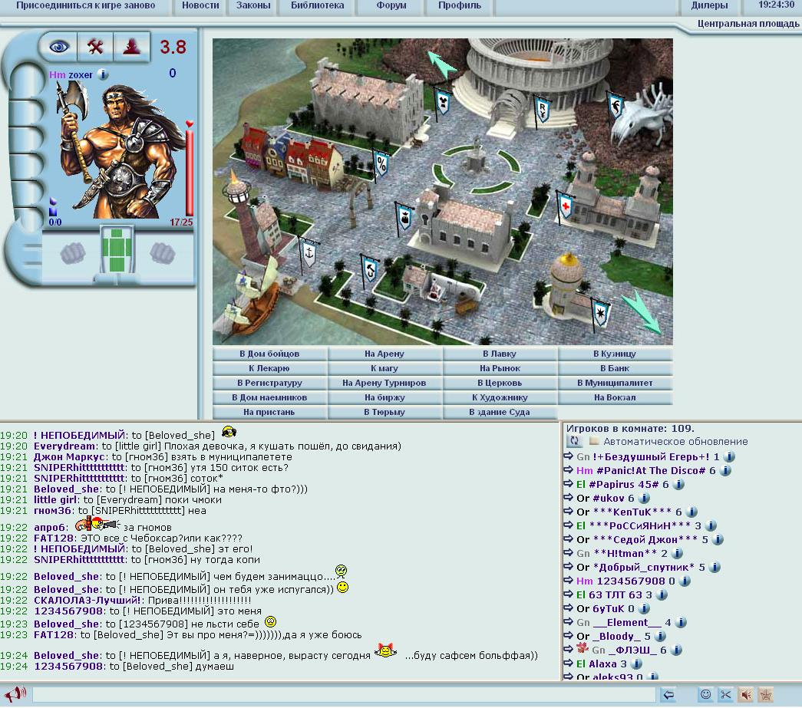

# Развлеку вас маленькой Генеалогией морали....

Развлеку вас маленькой “Генеалогией морали”. На RPS, кстати, был очаровательный репортаж о том, как в самых дурацких онлайн-играх, развитие в которых соответствует исключительно вложению денег, появляются сообщества, построенные на дружбе, солидарности, взаимопомощи и всяких таких чудесных вещах[1]. Удивительно, как мало нужно для появления крепкой дружбы. Что насчет классового самосознания? Вот история о том, как в одной старой русской ММОРПГ случилась, по сути, попытка установления игроками анти-капиталистической культурной гегемонии, в пику неолиберально настроенным администраторам проекта. 
 
“Apeha.ru” появилась в 2003 г. и завоевала популярность, в первую очередь, агрессивными стратегиями продвижения (например, игры от 7wolf ставили ее главной страницей в браузере). В Апеху можно было поиграть прямо из браузера, без каких-либо плагинов и флеша, а потому выглядела она не очень и не была богата игровыми возможностями. Однако за счет этого в нее можно было легко поиграть с работы или из компьютерного класса школы, а общение в чате, который постоянно был открыт на полстраницы, давало поводы вернуться куда более серьезные, чем незаконченные квесты. В итоге она действительно была довольно популярна среди русских школьников и офисного планктона, категорий людей, среди которых в начале 2000-х было немало тех, кто не мог, не хотел, считал странным и невозможным платить за какие-то виртуальные блага в этой игрушке: пролетариата в мире онлайн игр. 
 
Сами создатели игры позиционировали ее сначала как некоммерческий проект. По игровому процессу видно, что ее автор осознанно пытался создать меритократическую утопию. Игра заключалось в том, что персонажи участвовали в битвах, за победу в которых им начислялся опыт. Этот опыт однозначно определял уровень персонажа, что типично, но еще и приносил ему деньги: по 100 соток за каждые 100 очков опыта. Это довольно долго являлось единственным источником внутриигрового дохода, особенно для персонажей низких уровней. В итоге получалось, что опыт, уровень и наличные средства персонажа росли все вместе и с одинаковой скоростью, а это приводило к довольно-таки радикальному “равенству возможностей”: у персонажей одинакового уровня был (за всю их игровую историю) в распоряжении одинаковый бюджет, доступ к одному и тому же капиталу. Что было, как и полагается настоящей утопии, крайне жестокой системой: она не прощала ошибок. Представьте себе, что вам и всем вокруг каждый день с рождения дают определенную сумму, и эта сумма никогда не может поменяться. Все копят вместе, все равны! Но если вы потратите однажды деньги на конфеты, то это будут деньги, которые вы никогда не сможете восполнить, и вы всегда будете отставать от своих сверстников. 
 
Конечно, это не так страшно в жизни, как в игре, основанной исключительно на битвах игроков друг с другом. Но в Апехе, действительно, тратиться на какие-либо временные блага было стратегической ошибкой. Любое временное преимущество лишь ускоряло ненадолго развитие, за счет последующего вечного отставания по финансам. В итоге сформировался набор игровых возможностей, которые не могли быть использованы теми, для кого опыт был единственным источником дохода: всякие временно действующие или одноразовые свитки, зелья, прочие подобные штуки. Нормальным использование таких вещей могло быть лишь для тех, кто был готов тратить на них какие-то другие средства - вкладывать реальные деньги. Другими словами, любые временные блага, будучи номинально доступны всем, довольно-таки однозначно являлись атрибутами классового врага: “реальщика”. 
 
Проходит время, администрация игры меняется и начинает пытаться заработать на игроках побольше денег. Конечно, любые подвижки такого рода сопровождались разного рода жалобами игроков победнее - их, разумеется, игнорировали. Но пролетарское классовое сознание дошло до идеи похитрее. Довольно быстро сформировалась особого рода этика, запрещавшая любые преимущества, актуальные лишь для “реальщиков” (свитки, вмешательства в бой и т.п.). Она называлась “честным боем” и состояла из набора запретов на вещи, которые были, как и полагается атрибутам привилегированного класса, понятны всем без объяснений: “нечестность” была очевидна всем и конкретные положения ее правил практически никогда никем не диспутировались. Конечно, были и формулировки этих правил в виде кодексов[2], но они были вторичны самой логике классовой борьбы. Жалобы в чате на нарушение любого из этих правил было достаточно, чтобы многие честные игроки влезли в битву и быстро побеждали всех нечестных. 
 
Правила​ ​“честного​ ​боя”​ ​не​ ​являются​ ​частью​ ​технических​ ​правил​ ​игры,​ ​никак​ ​не санкционированы​ ​ее​ ​авторами​ ​и​ ​появились​ ​в​ ​среде​ ​самих​ ​игроков.​ ​Они​ ​являются вполне​ ​достойным​ ​примером​ ​политической​ ​субъективации.​ ​Разумеется,​ ​эти​ ​правила вызвали​ ​и​ ​реакцию​ ​среди​ ​игроков​ ​правых​ ​взглядов,​ ​которая​ ​в​ ​итоге​ ​была поддержана​ ​и​ ​выражена​ ​в​ ​полной​ ​мере​ ​администрацией​ ​игры​ ​в​ ​формулировке, цитируемой​ ​многими​ ​не​ ​согласными​ ​с​ ​этикой​ ​“честного​ ​боя”​ ​игроками:​ ​“Никто​ ​не 
имеет​ ​права​ ​ограничивать​ ​действия​ ​других​ ​игроков​ ​в​ ​области​ использования​ ​любых законных​ ​игровых​ ​возможностей.​ ​Вы​ ​вправе​ ​использовать​ ​любые​ ​игровые возможности,​ ​и​ ​никто​ ​не​ ​вправе​ ​вам​ ​это​ ​запретить.​ ​Честный​ ​бой​ ​тот,​ ​в​ ​котором используются​ ​полностью​ ​все​ ​игровые​ ​возможности,​ ​а​ ​нечестный​ ​бой​ ​–​ ​это​ ​тот,​ ​в котором​ ​прокачивается​ ​один​ ​персонаж,​ ​за​ ​счет​ ​другого,​ ​в​ ​том​ ​числе​ ​и​ ​за​ ​счет​ ​запрета другому​ ​персонажу​ ​на​ ​использование​ ​игровых​ ​возможностей”. 
 
В​ ​дальнейшем​ ​администрация​ ​ввела​ ​наказания​ ​в​ ​виде​ ​ограничения 
возможностей​ ​общения​ ​в​ ​чате​ ​или​ ​даже​ ​возможности​ ​играть​ ​за​ ​само​ ​упоминание “Честного​ ​боя”1.​ ​Так​ ​была​ ​подавлена​ ​одна​ ​маленькая​ ​борьба​ ​игрового​ ​сообщества​ ​за равенство,​ ​почти​ ​невозможная​ ​в​ ​современном​ ​мире,​ ​в​ ​котором​ ​платить​ ​за​ ​игры стало​ ​культурной​ ​нормой.
 
[1]: 
https://www.rockpapershotgun.com/2017/07/19/playing-the-most-shameless-clickbait-ga
mes-on-the-internet/ 
[2]:​ ​​http://fairplay.clan.su/index/0-7

Date: 2017-08-12 14:02
Likes: 54
Comments: 3
Reposts: 1
Views: 2653
Original URL: https://vk.com/wall-140963346_55

--------------------

  * Как всегда, познавательно) спасибо.
    Author: 348250758, Date: 2017-08-12 14:12, Likes: 0*

  * Странно, мне вроде игры вообще не интересны, но этот паблик - один из любимейших. Читать не только интересно, от постов просто мир начинаешь с другой стороны видеть. Это очень круто, спасибо за это.
    Author: 31701011, Date: 2017-08-14 01:55, Likes: 0*

  * Все, накрылась гама. Никого почти в онлайне, столько денег с неё админы рубили и ни копейки не вложили (в процентом отношении)
    Author: 327927067, Date: 2017-08-28 00:23, Likes: 0*

