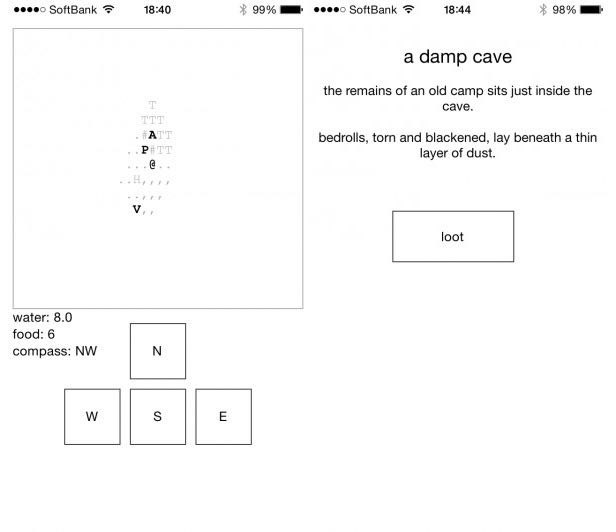

# Единственная ситуация в которой в...

Единственная ситуация, в которой в Fallout 4 мы переживаем что-то, действительно похожее на приключение, это когда у нас с собой слишком много вещей, и игра не дает нам бежать дальше. Тогда приходится принимать решение: что мы выкинем, что оставим. Или, возможно, мы решим, что нам пора вернуться куда-то, чтобы где-то их оставить или продать. Все прочее время в игре мы (если не умудриться проникнуться сюжетом) довольно рутинно продираемся куда-то вперед или рутинно занимаемся ремеслами. Никакой разницы между тем, как мы убиваем всех вокруг в начале и конце игры нет; здесь нет никаких решений, нет повода к “рефлексии”; без возвращения в какую-то точку, где когда-то что-то нам было нужно, нет и ощущений награды и достижения. Но вот эти редкие моменты, когда мы (буквально) перегружены таскаемыми вещами, заставляют остановиться и подумать: а что мы, собственно, делаем? Что нам нужно иметь? Нужно ли нам возвращаться? Куда? Зачем? Это уже Гомер знал: приключению необходимо возвращение.

Лучше всего таким образом передает приключение A Dark Room ( http://adarkroom.doublespeakgames.com/ , можно играть в браузере или на телефоне). Эта красивая, минималистичная, очень медленно раскрывающаяся игра дает нам прочувствовать дом прежде, чем отпускает на поиски приключений. Дом это место, где вполне спокойно и при этом скучновато, хочется чего-то большего – больше “ресурсов”, чего ж еще. Поэтому возможность отправиться в какие-то непонятные поиски непонятно чего непонятно куда вызывает воодушевление. Мы оказываемся посреди огромного белого поля, по которому мы медленно, как по сугробу, шагаем в сторону, выбор которой мы быстро научаемся обдумывать (см. картинку).

Это не запуск ракеты на Марс и не отчаянный рывок к смерти. Каждая вылазка в игре имеет две цели: не только найти что-то полезное, но и вернуться домой. Это не очень просто, а потому довольно сильно влияет на динамику игры. Шаги обдумываются, расчитывается запас еды. Вопрос больше не в простом избежании смерти. Во многих играх достаточно шагать вперед и не умирать, чтобы победить. Решать особенно нечего. Пол Грэм, идеолог американских стартапов, говорит, что со стартапами так же. Это потому, что он не хочет, чтобы создатели стартапов думали о том, что будет потом. В A Dark Room это, наоборот, самый важный вопрос. Приключение, которое было слишком коротким, абсолютно бессмысленно; слишком же, не посилам длинное – смертельно.

Поэтому каждый следующий поход продвигается буквально на пару полей дальше, чем предыдущий. Это, в общем-то, тяжелая работа, но не такая уж и рутинная. Уже исследованные, пустые места обозначается точечками; каждую точечку приходится с усилием вырывать из белой пустоты. Карта медленно раскрывается, и игра так же медленно, но ощутимо меняется, но ни в какой момент не появляется уверенности, что дальнейшее продвижение вперед будет действительно что-то менять. Именно поэтому каждый сюрприз становится сюрпризом, и приключение оказывается приключением.

    Date: 2017-10-08 18:43
    Likes: 113
    Comments: 3
    Reposts: 9
    Views: 8434
    Original URL: https://vk.com/wall-140963346_70

--------------------

  * Прикольно. Но белость меня немного смущает.
    Author: Ksyushanchik Lyamina, Date: 2017-11-09 15:51, Likes: 1

  * [id228735273|Ксюшанчик], можно сделать всё черным!
    Author: Charles Manson, Date: 2017-11-28 12:13, Likes: 0

  * там кстати точечка это пустое поле, если растительности больше то запятая или точка с запятой, очень выразительно
    Author: Charles Manson, Date: 2017-11-28 12:14, Likes: 3

