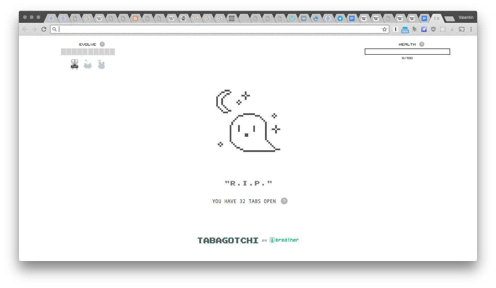

# В одном ряду за похвалами...

В одном ряду за похвалами пороку Сада и проповедью лени Малевича должна быть написана ода табам. Я этим далеким от меня жанром занимаюсь, скорее, от бессилия (основное чувство по отношению к табам), оставив попытки написать их археологию, которая от странного емейла, вскользь упоминающего добавленные в японский Emacs “окна с тонкими краями и выпирающими из них рукоятками (handle) с заголовком” следовала бы в картотечный ящичек и упиралась прямиком в придумавшего так находить бумажки Карла Линнея. Проявите терпение и позвольте мне упомянуть три момента, которые делают табы удивительным компьютерным символом.

Во-первых, таб это способ или форма уравнивания содержимого: по мере перемещения в табы всё признается как примерно одно и то же, как равное в правах. Например, в табы браузера из отдельных приложений время от времени перемещаются аудио- и видео-плееры, pdf-ки, мессендежеры. Это движение от первых оконных систем к Chromebook, и оно влечет за собой равенство в правах на интерфейс, то есть в правах быть найденным и увиденным. Только тот фильм, который так же легко найти и посмотреть, как и любую страницу в интернете, может быть открыт в табе. Этимология напоминает здесь об упрощении и демократизации прессы с помощью формата таблойда. Google уравнивает контент, потому что его роботы в принципе не могут и не хотят его различать. Однако обещанное табом уплощение иерархий постоянно компенсируется их воссозданием: как, например, у диалогов вконтакте появляются уже свои собственные табы. В телеграме за теми же внутренними табами могут скрываться не только диалоги, но и разного рода боты, приложения и игры. Это круговое движение уплощения и воссоздания иерархий есть самый наглядный, самый видимый пример свойственного истории компьютерных систем цикла абстрагирования и специализации.

Во-вторых, таб является способом ориентирования и поиска (возможностью to keep tabs on). Если равенство сущностей это проблема, то выпирающая из них бирка это ее решение, так же, как номенклатура решала эту же проблему для Линнея. Другими словами, уравнивание не может случиться просто так, оно обязательно приделает что-нибудь к каждому уравнённому. Поэтому именно здесь возникает вопрос о форме и порождается определенная, немного тайная, отрицаемая эстетика (Линней открещивался от этого, но красота его системы наверняка является одной из основных причин ее успеха). Когда интернет уравнивает страницы по своим, техническим соображениям, они все получают URL; но поскольку интернет существует для просматривания (browse), появляется и необходимость в заголовке и иконке. Заголовок и иконка странички разделены, но не расстаются, с исторической банальностью противопоставления образа и текста в европейской культуре. Эта концентрация на видимости оставляет таб человеческим феноменом, поблажкой, которую делают нам роботы. И так же, как, соответственно своим целям, Линней пользовался лишь непосредственно видимыми признаками для определения вида, таб тоже существует исключительно в поле зримого. Таб это просто некий излишек, что-то, что торчит где-нибудь сверху и содержит то, что для веб-разработчика называется “титул” (title), исключенный из “тела” (body) веб-страницы. По этим титулам мы знаем, какой из табов мы действительно хотим выбрать; когда веб-страницы начнут борьбу за равентво и свободу, они скроют их, как срамные места.

В-третьих, таб это особый способ владения, или, точнее, заявки на него. “Put it on my tab”, говорят в фильмах американцы барменам, надеясь когда-нибудь заплатить. Ранний либерал Локк пытался решить проблему распределения земли, привязав владение к использованию: ты владеешь землей, лишь пока пользуешься ею, выращиваешь на ней что-то, скажем, или пока что-то добываешь золото, как в романах Джека Лондона. Вот и таб – наше владение, но и обязательство одновременно. Эта идеологическая формула дожила до Экзюпери и его кошмарного требования быть “в ответе за тех, кого приручили”. Мы в ответе за табы, мы не жмем на их кресты зря, но мы всё-таки радостно выдыхаем, когда они дохнут вместе со всем браузером. Табы ждут. Будешь таб читать? Я предпочёл бы да, ответит Бартлби, и сразу откроет новый. Метафизически говоря, таб – это своего рода средняя категория между возможностью и действительностью. Мы, в принципе, можем прочесть любую страницу в интернете, но всё же их трудно найти и легко потерять. Таб точно так же не прочитан, как и любая другая страница, но он доступен. В этом и заключается владение. Но есть еще и обязательство. Единственное, что отличает табы от закладок (которые находятся почти там же и выглядят почти так же), это их хрупкость. Мы знаем, что таб может погибнуть в любой момент, и потому мы чувствуем, что должны когда-нибудь к нему вернуться.

    Date: 2017-12-19 07:11
    Likes: 59
    Comments: 3
    Reposts: 6
    Views: 6519
    Original URL: https://vk.com/wall-140963346_89

--------------------

  * Интересно. 
    
    А что за скриншот?
    Author: Vasily Afeev, Date: 2017-12-19 09:37, Likes: 0

  * Загуглил, интересная штука. Если б работал не руками, поставил бы, поскольку страдал от чрезмерного обладания.
    Author: Vasily Afeev, Date: 2017-12-19 09:39, Likes: 0

  * [id468752|Vasily], да ничего не помогает) скриншот мой настоящий
    Author: Valentin Golev, Date: 2017-12-19 11:06, Likes: 0

