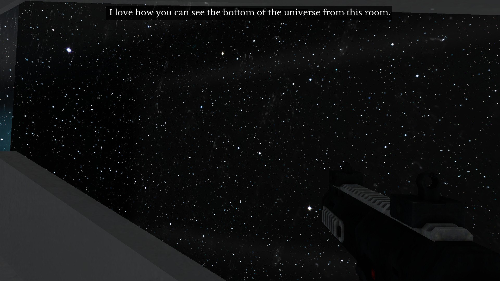

# По совету дорогого мне друга...

По совету дорогого мне друга - одного из образов всех наших скромных надежд, которые в отсутствии утомительных правильных знакомств и адекватной амбициям институциональной принадлежности достигают всех возможных успехов, достижений и признаний - сыграл в The Beginner’s Guide. Играл я в неё, разумеется, для дела - пытаясь понять, как вообще строятся игры; поэтому я должен пойти дальше психологической интерпретации (более-менее очевидной), и увидеть в двух персонажах, Коде и рассказчике, две важные силы, которые строят игры вообще. 

Всё то, что показывает нам рассказчик, как игры Коды, даже играми, в общем-то, зачастую толком не является. Это просто какие-то симуляции. Кода олицетворяет ту силу, что создаёт симуляцию, некое систематическое построение мира, игровую реальность. Его надо понимать именно с оглядкой на фрейдовский “принцип реальности”, то есть на некую фантазию о том, что есть “объективная реальность”, что мир устроен логично, что мы знаем цену вещам, что что-то возможно сейчас, а для чего-то придется честно стараться: ту фантазию о понятности мира, которая заставляет нас заключать постоянные сделки с самими собой, ограничивать себя и подчиняться чему-то. Именно фантазия про “принцип реальности” и создает симуляцию (прото-игру, “движок”). В играх Коды реальность, то есть фантазия о ее принципиальности, доведена до крайности, а значит (перечисляю в не очень точном порядке) невозможно всё; всё сломано; всё требует бесконечно много (времени); всё оказывается не тем, что ожидалось. 

Позвольте мне репризу: представьте себе, что вы создали идеальную физическую симуляцию (или экономическую, или психологическую, или какую угодно). Она самодостаточна: тела ("акторы") взаимодействуют, живут своей жизнью. Система существует. В самом обычном цикле она повторяет свою собственную логику, раз за разом слегка подправляя обобщенные координаты каждого из тел. И ясно, что теперь любое вмешательство игрока будет нарушать ее законы, в первую очередь, законы сохранения. Он может только разрушать систему, в принципе упразднять ее законы; чтобы сделать происходящее хоть сколько-то конструктивным, игрока нужно каким-то образом подчинить тем же законам, что и систему, и зациклить его в этом новом, ограниченном движении. Вполне следуя за развитием упомянутой мысли Фрейда, навязчивое повторение одного и того же действия в промежутках между кат-сценками создаёт иллюзию того, что мы вообще чем-то управляем. 

Рассказчик же, выполняя свою задачу рассказчика, делает то, что я привык ждать от рассказа: он делает как-то вдруг, как будто бы просто ради того, чтобы было можно вести повествование, что-то невозможное возможным, не упраздняя, конечно, реальность вообще. “Вы не сможете играть в эту игру”, повторяет он, “она слишком сложная - поэтому я для вас ее чуть-чуть сейчас подправлю”. Нарративное развитие игры является уничтожением повторения, но потому же и спасением от его навязчивого наслаждения. Рассказчик в TBG очень торопится и не даёт нам даже однажды повторить то, что, по задумке Коды, должно было бы повторяться вечность. Но игра воссоздаёт повторение на новом уровне, на уровне образов, которые (как нам и обещают) повторяются и даже зацикливаются в ходе сюжета: и это более высокое повторение позволяет игру в “свободу интерпретации”.

    Date: 2018-01-16 23:35
    Likes: 70
    Comments: 5
    Reposts: 8
    Views: 3771
    Original URL: https://vk.com/wall-140963346_96

--------------------

  * по совету Нэвэльного что ли в нее играл?)
    Author: Konstantin Shepelin, Date: 2018-01-18 06:29, Likes: 0

  * TBG уникальная игра, позволяющая глубже понять не только процесс создания игрового пространства, но и правила, по которым оно может в принципе функционировать. Как и все ваши статьи позволяют читателям понять новые аспекты игровых "функций", да и узнать о действительно интересных играх. В этом плане хотелось бы вам порекомендовать "Мор (Утопию)", если вы ее еще для себя не открыли. Мне кажется, она сможет вас заинтересовать.
    Author: Alexandra Ryzhova, Date: 2018-01-18 23:17, Likes: 0

  * Еще классический пример — Тургор. Особенно хорошо, как мне кажется, его начинать анализировать после этих выступлений:
    
    (Текстовая версия: http://gamestudies.ru/post/228)
    Author: Ilya Bobrov, Date: 2018-01-22 18:57, Likes: 0

  * 
    Author: Ilya Bobrov, Date: 2018-01-22 18:57, Likes: 0

  * "И ясно, что теперь любое вмешательство игрока будет нарушать ее законы, в первую очередь, законы сохранения." - 81 год назад Н.А. Бердяев высказался в духе того, что именно таковы отношения человека и природно-социальной реальности: http://odinblago.ru/sverhlichnie_cennosti. Если суммировать его статью: дух врывается в реальность и всё в ней нарушает, меняет, переставляет местами, путается в ней, как большая и норовистая рыба в сети - но и сам ей отягощён. Фундамент всякого геймплея он рассказывает в терминах богословия.
    Author: Mikhail Mosienko, Date: 2018-01-22 19:09, Likes: 0

