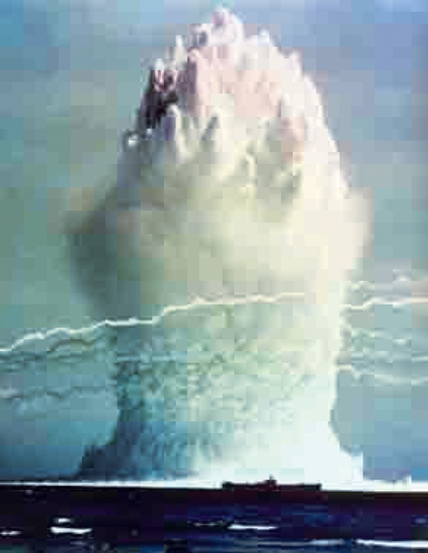

# Пиксель в цифровой фотографии а...

Пиксель, в цифровой фотографии (а так же в видео и цифровом фотореализме), это символ отрицания реальности формы. В отличие от прочих изобразительных искусств, от живописи до аски-арта, от скульптуры до мозаики, от витражей до вышивания крестиком, фотография (разбитая на пиксели) конкретную форму никак не хранит, отдавая ее воссоздание смотрящему. Прочие искусства, извращая, меняя, обманывая формы вещей, настаивают на тех формах, что были созданы художником; только фотография оказалась искусством, которое изображает, не создавая форму. Другими словами, в фотографии форма, конечно, никуда не девается, но ее место смещается. Она не изображается, но следует из изображаемого. В этом она похожа на нововременную теорию познания, вписывающую формы лишь нам в голову. Для Аристотеля дело было не так – форма была предметом, общим для разума и для обдумываемых вещей; разум сам принимал форму вещи, а не создавал ее с нуля. Фотореализм, как и некоторые другие “реализмы”, оборачивается, таким образом, самым настоящим солипсизмом: солипсизм это не отрицание материи, но отрицание реальности форм. 

Пиксель невидим. Пиксель это один конкретный цвет, видимый из одной конкретной точки. Цвет этот довольно непредсказуем и совершенно необязательно как-то похож на цвет предмета (помните историю с золотым/голубым платьем?). Если чуть-чуть сдвинуть камеру, все пиксели изменятся, но не примут цвета своих соседей. Пиксель это буква фотографии, ее минимальный элемент, который в принципе не может ничего означать. Цвет в других изобразительных искусствах имеет самостоятельное значение; здесь он, как и форма, может принимать значение лишь после того, как он был опосредован – после того, как мы узнали в наборе пикселей каких-то цветов конкретный цвет, которого среди них могло и не быть. 

Хранить изображение в пикселях является определенным техническим решением, решением о неважности специфики формы. Оно ничем по сути не отличается от сэмплирования сигнала, как при переводе звука в цифровой формат. JPEG, важнейший алгоритм сжатия изображений, даже пользуется преобразованием Фурье. Это преобразование, представляющее произвольный сигнал как сумму волн, находит в нем именно ритмы, а не уникальные вещи; если посмотреть на глитч JPEG, модный не так давно, то он выдает именно эту деталь алгоритма, умножая вещи и сдвигая их по фазе. Компьютеры умеют работать напрямую с реальностью, лишь разлагая ее на некие пре-формальные элементы: пиксели, паттерны, вероятности, веса нейронных сетей. Чтобы признать в мире форму, нужно принять об этом решение: компьютеру это ни к чему.

(изображение: Thomas Ruff)

    Date: 2018-09-02 13:22
    Likes: 75
    Comments: 1
    Reposts: 3
    Views: 3047
    Original URL: https://vk.com/wall-140963346_253

--------------------

  * Даешь векторную графику! CDM в массы! Нехай компьютер тоже грузится вопросами о распознавании форм.
    Author: Akkaunt Udalen, Date: 2018-10-24 15:32, Likes: 0

