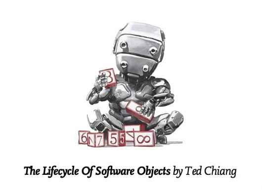

# Читал недавно Теда Чана Ted...

Читал недавно Теда Чана (Ted Chiang) - “The Lifecycle of Software Objects”. Это повесть о том, как люди придумали в виртуальном мире виртуальных разумноватых зверьков (“диджиенты”), привязались к ним, а потом пытались как-то их спасти от капитализма. Можно читать ее как некую фантазию про будущее, про искусственный интеллект и все такое, но я предлагаю рассмотреть эту книгу как обращенную к настоящему. 
 
Т.е.: вот все эти книги и фильмы про будущее, о чем они говорят? В каком-то смысле они более relatable, чем все эти дурацкие романы про проблемы скуки в образованных американских пригородах. Может быть, проблемы искусственного интеллекта в будущем, это и есть проблемы нас в настоящем - отчужденных настолько, что литература может описывать наш опыт, только когда говорит не о людях. 
 
Итак, сюжет романа таков (не уверен, что я что-то испорчу для вашего будущего чтения, описав в общих чертах). Был виртуальный мир, в нем запустили зверьков с искусственным интеллектом. Они были очень милые и бесполезные. Научились разговаривать и что-то там в сторонке мастерить. Потом придумали новый виртуальный мир и старый решили закрыть из соображений профитабельности. Что делать со зверьками? Перепрограммировать их дорого, нужно придумать какой-то способ извлечь из них прибыль. На какую работу устроить милых, разумных зверьков? 
 
Вообще мы можем распознать в том, как Чан строит этот роман, довольно ясную структуру. Каждую конкретную проблему он рассматривает, во-первых, сразу с разных точек зрения, эмоциональной, экономической, легальной и т.д. - “каково это, существовать?”, “что такое существовать с точки зрения закона?”. Во-вторых, он пытается рассмотреть разные субъекты этой проблемы: “как существуют зверята?”, “как существуют корпорации?”. Признав эту структуру, искусственный интеллект можно рассматривать здесь, как просто посредник для иллюстрации человеческих проблем, как новое достижение науки, которое позволяет смотреть на себя. Вспоминается “Избирательное сродство” Гёте, которое Беньямин рассматривал, как роман о попытке применить понятие закона природы (из химии) к людям и их судьбам - не столько ассимилируя научный дискурс в литературу, сколько переосмысляя основное понятие литературы (судьба) с точки зрения новых достижений науки. Вот и здесь Чаном переосмысляется существование с точки зрения достижений капиталистических технологий. 
 
Так вот, главный партнер искусственного интеллекта по проблемам в романе это женщина. Женщина тоже, по Чану, мила, образована в духе liberal arts, не очень полезна на производстве, и ее существование как участника капиталистического процесса тоже под угрожающим ее физическому существованию вопросом (не знаю, насколько ясно Чан осознавал эту параллель, но она работает и в описаниях, и по сюжету). Раз за разом Чан задается вопросом: зачем нужны эти милые, эмпатичные, разносторонние, но не очень технически подкованные и полезные на заводах существа? Причем в случае женщин на горизонте постоянно маячит ответ: чтобы рожать и воспитывать. С этим ответом главная героиня открыто, конечно, борется. 
 
В итоге в случае зверьков ответом оказывается просто-напросто секс. Эти милые и эмпатичные “диджиенты” могут зарабатывать исключительно как секс-работники. Для всех остальных использований менее эмпатичные и осознанные, более аутичные роботы куда эффективнее. Вообще мне немного странно, что Чан вообще не придумал никакой альтернативы. В конце концов, они могли бы, не знаю, преподавать. Три “невозможные профессии” Фрейда (учитель, психоаналитик, политик) - те профессии, которые заключаются в том, чтобы создать субъект там, где его не было - вот первое, что приходит в голову, когда я думаю о том, для чего столь любимая капиталистами аутичность разумного робота была бы помеха. Проститутку, возможно, тоже нужно внести в этот список. Но вообще, ну да. Учиться в liberal arts-заведении и подрабатывать на вебку - вполне типичный сценарий сейчас. 
 
Все в романе, конечно, охают и ахают по поводу такого решения, особенно воспитатели диджиентов, как-то изначально предполагая вредность и бездуховность секс-работы (и, конечно, страдания секс-работников). Предлагаются какие-то аргументы за и против в духе всех этих либеральных колонок по поводу возможности консента. Вопрос, который Чан вообще не ставит (мое второе разочарование) - о том, что такое вообще секс. Стивен Шавиро в “Discognition” хвалит Чана за то, что он не проводит жестких границ между жизнью и не-жизнью, интеллектом и не-интеллектом и так далее. Но в той точке, которая для Чана оказывается ключевой, т.е. в вопросе о сексе, Чан пишет так, будто всем понятно, что такое секс и как он отличается от не-секса, причем никакого конкретного определения никто не дает и, например, никакие гениталии вообще не упоминаются. 
 
Вопрос Чан ставит хорошо, но его ответ лишен нюанса и звучит как грустная анти-капиталистическая агитка - мол, капитализм нас проституирует - ну что ж, давайте его отменим, раз все так плохо, и пойдем займемся коммунистическим сексом бесплатно и без страданий.

    Date: 2018-12-09 14:08
    Likes: 40
    Comments: 0
    Reposts: 3
    Views: 2890
    Original URL: https://vk.com/wall-140963346_289

